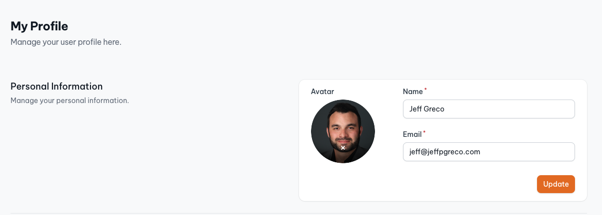
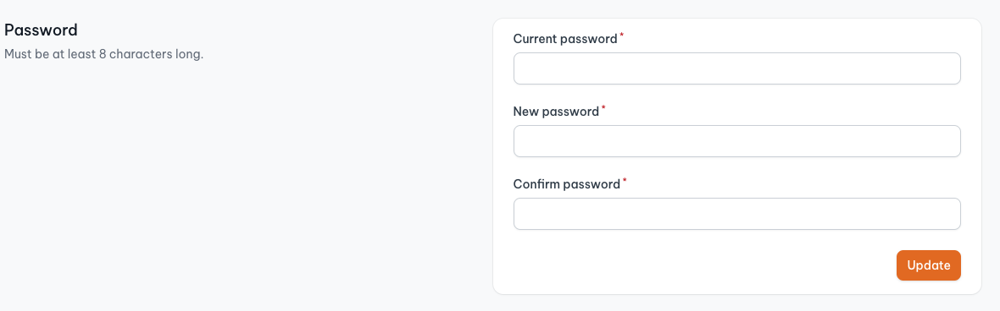
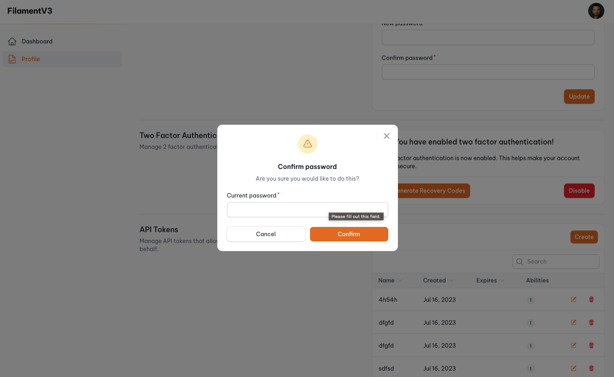
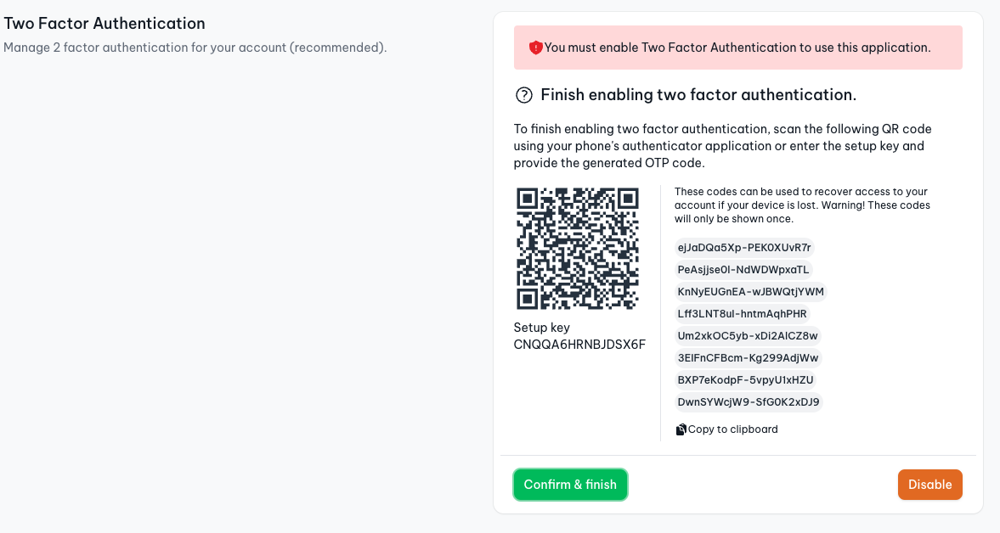
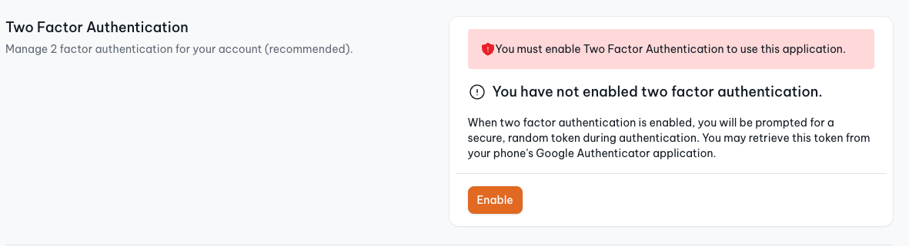
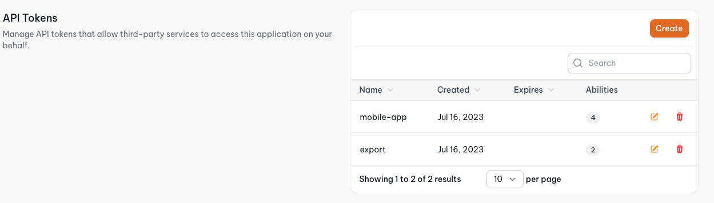
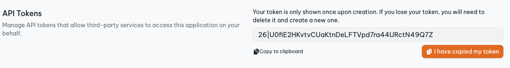

# Enhanced security for Filament v3+ Panels.

[](https://packagist.org/packages/jeffgreco13/filament-breezy)
[](https://packagist.org/packages/jeffgreco13/filament-breezy)

Enhanced security features for Filament (v3) Panels. Includes a customizable My Profile page with personal info & avatar support, update password, two factor authentication, and Sanctum token management.
Installs in minutes!

## Features & Screenshots
My Profile - Personal info with avatar support

Update password with customizable validation rules

Protected sensitive actions with a password confirmation modal Action

Two factor authentication with recovery codes

Force the user to enable two factor authentication before they can use the app

Create and manage Sanctum personal access tokens



## Installation

Install the package via composer and install:

```bash
composer require jeffgreco13/filament-breezy
php artisan breezy:install
```

Optionally, you can publish the views using:

```bash
php artisan vendor:publish --tag="filament-breezy-views"
```

## Usage & Configuration

You must enable Breezy by adding the class to your Filament Panel's `plugin()` or `plugins([])` method:

```php
use Jeffgreco13\FilamentBreezy\BreezyCore;

class CustomersPanelProvider extends PanelProvider
{
    public function panel(Panel $panel): Panel
    {
        return $panel
            ...
            ->plugin(
                BreezyCore::make()
            )
    }
}
```

### Update the auth guard

Breezy will use the `authGuard` set on the Filament Panel that you create. You may update the authGuard as you please:

```php
use Jeffgreco13\FilamentBreezy\BreezyCore;

class CustomersPanelProvider extends PanelProvider
{
    public function panel(Panel $panel): Panel
    {
        return $panel
            ...
            ->authGuard('customers')
            ->plugin(
                BreezyCore::make()
            )
    }
}
```

**NOTE:** you must ensure that the model used in your Guard extends the Authenticatable class.

### My Profile

Enable the My Profile page with configuration options.

**NOTE:** if you are using avatars,

```php
BreezyCore::make()
    ->myProfile(
        shouldRegisterUserMenu: true, // Sets the 'account' link in the panel User Menu (default = true)
        shouldRegisterNavigation: false, // Adds a main navigation item for the My Profile page (default = false)
        hasAvatars: false, // Enables the avatar upload form component (default = false)
        slug: 'my-profile' // Sets the slug for the profile page (default = 'my-profile')
    )
```

#### Using avatars in your Panel

The instructions for using custom avatars is found in the Filament v3 docs under [Setting up user avatars](https://filamentphp.com/docs/3.x/panels/users#setting-up-user-avatars).

Here is a possible implementation using the example from the docs:

```php
use Illuminate\Support\Facades\Storage;
use Filament\Models\Contracts\HasAvatar;
use Illuminate\Foundation\Auth\User as Authenticatable;

class User extends Authenticatable implements FilamentUser, HasAvatar
{
    // ...

    public function getFilamentAvatarUrl(): ?string
    {
        return $this->avatar_url ? Storage::url($this->avatar_url) : null ;
    }
}

```

#### Customize the avatar upload component


```php
use Filament\Forms\Components\FileUpload;

BreezyCore::make()
    ->avatarUploadComponent(fn($fileUpload) => $fileUpload->disableLabel())
    // OR, replace with your own component
    ->avatarUploadComponent(fn() => FileUpload::make('myUpload')->disk('profile-photos'))
```

#### Customize password update

You can customize the validation rules for the update password component by passing an array of validation strings, or an instance of the `Illuminate\Validation\Rules\Password` class.

```php
use Illuminate\Validation\Rules\Password;

BreezyCore::make()
    ->passwordUpdateRules(
        rules: [Password::default()->mixedCase()->uncompromised(3)], // you may pass an array of validation rules as well. (default = ['min:8'])
        requiresCurrentPassword: true, // when false, the user can update their password without entering their current password. (default = true)
        )

```
#### Create custom My Profile components

In Breezy v2, you can now create custom Livewire components for the My Profile page and append them easily.

1. Create a new Livewire component in your project using:

```
php artisan make:livewire MyCustomComponent
```

2. Extend the `MyProfileComponent` class included with Breezy. This class implements Actions and Forms.

```php
use Jeffgreco13\FilamentBreezy\Livewire\MyProfileComponent;

class MyCustomComponent extends MyProfileComponent
{
    protected string $view = "livewire.my-custom-component";

    //

    public array $data;

    public function form(Form $form): Form
    {
        return $form
            ->schema([
                Forms\Components\TextInput::make('name')
                    ->required()
            ])
            ->statePath('data');
    }
}

```

3. Within your Livewire component's view, you can use Breezy's `grid-section` blade component to match the style:

```blade
<x-filament-breezy::grid-section md=2 title="Your title" description="This is the description">
    <x-filament::card>
        <form wire:submit.prevent="submit" class="space-y-6">

            {{ $this->form }}

            <div class="text-right">
                <x-filament::button type="submit" form="submit" class="align-right">
                    Submit!
                </x-filament::button>
            </div>
        </form>
    </x-filament::card>
</x-filament-breezy::grid-section>
```

4. Finally, register your new component with Breezy:

```php
use App\Livewire\MyCustomComponent;

BreezyCore::make()
    ->myProfileComponents([MyCustomComponent::class])
```

#### Override My Profile components

You may override the existing MyProfile components to replace them with your own:

```php
use App\Livewire\MyCustomComponent;

BreezyCore::make()
    ->myProfileComponents([
        // 'personal_info' => ,
        'update_password' => MyCustomComponent::class, // replaces UpdatePassword component with your own.
        // 'two_factor_authentication' => ,
        // 'sanctum_tokens' =>
    ])
```

#### Sorting My Profile components

Custom MyProfile components can be sorted by setting their static `$sort` property. This property can be set for existing MyProfile components in any service provider:

```php
TwoFactorAuthentication::setSort(4);
```

A lot of the time this won't be necessary, though, as the default sort order is spaced out in steps of 10, so there should be enough numbers to place any custom components in between.

### Two Factor Authentication

1. Add `Jeffgreco13\FilamentBreezy\Traits\TwoFactorAuthenticatable` to your Authenticatable model:

```php
use Jeffgreco13\FilamentBreezy\Traits\TwoFactorAuthenticatable;

class User extends Authenticatable
{
    use HasApiTokens, HasFactory, Notifiable, TwoFactorAuthenticatable;
    // ...

}
```

2. Enable Two Factory Authentication using the `enableTwoFactorAuthentication()` method on the Breezy plugin.

```php
BreezyCore::make()
    ->enableTwoFactorAuthentication(
        force: false, // force the user to enable 2FA before they can use the application (default = false)
        action: CustomTwoFactorPage::class // optionally, use a custom 2FA page
    )
```

3. Adjust the 2FA page

The Breezy 2FA page can be swapped for a custom implementation (see above), same as the Filament auth pages. This allows, for example, to define a custom auth layout like so:

```php
use Jeffgreco13\FilamentBreezy\Pages\TwoFactorPage;

class CustomTwoFactorPage extends TwoFactorPage
{
    protected static string $layout = 'custom.auth.layout.view';
}
```

### Sanctum Personal Access tokens

As of Laravel 8.x Sanctum is included with Laravel, but if you don't already have the package follow the [installation instructions here](https://laravel.com/docs/8.x/sanctum#installation).

Enable the Sanctum token management component:

```php
BreezyCore::make()
    ->enableSanctumTokens(
        permissions: ['my','custom','permissions'] // optional, customize the permissions (default = ["create", "view", "update", "delete"])
    )
```

### Password Confirmation Button Action

This button action will prompt the user to enter their password for sensitive actions (eg. delete). This action uses the same `'password_timeout'` number of seconds found in `config/auth.php`.

```php
use Jeffgreco13\FilamentBreezy\Actions\PasswordButtonAction;

PasswordButtonAction::make('secure_action')->action('doSecureAction')

// Customize the icon, action, modalHeading and anything else.
PasswordButtonAction::make('secure_action')->label('Delete')->icon('heroicon-s-shield-check')->modalHeading('Confirmation')->action(fn()=>$this->doAction())
```

## FAQ
> How the 2FA session work across multiple panels?

By default, Breezy uses the same guard as defined on your Panel. The default is 'web'. Only panels that have registered the BreezyCore plugin will have access to 2FA. If multiple panels use 2FA, and share the same guard, the User only has to enter the OTP once for the duration of the session.

> How does 2FA interact with MustVerifyEmail?

When 2FA is properly configured, and the User is prompted for the OTP code before email verification.

> How long does the 2FA session last?

The 2FA session is the same as the Laravel session lifetime. Once the user is logged out, or the session expires, they will need to enter the OTP code again.


## Testing

```bash
composer test
```

## Changelog

Please see [CHANGELOG](CHANGELOG.md) for more information on what has changed recently.

## Contributing

Please see [CONTRIBUTING](.github/CONTRIBUTING.md) for details.

## Security Vulnerabilities

Please review [our security policy](../../security/policy) on how to report security vulnerabilities.

## Credits

-   [Jeff Greco](https://github.com/jeffgreco13)
-   [All Contributors](../../contributors)

## License

The MIT License (MIT). Please see [License File](LICENSE.md) for more information.
