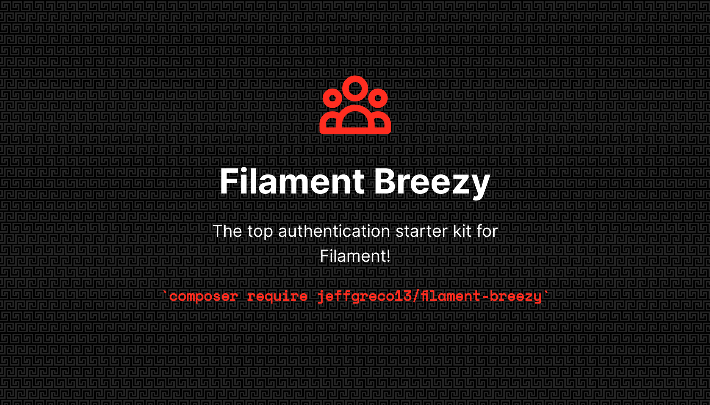
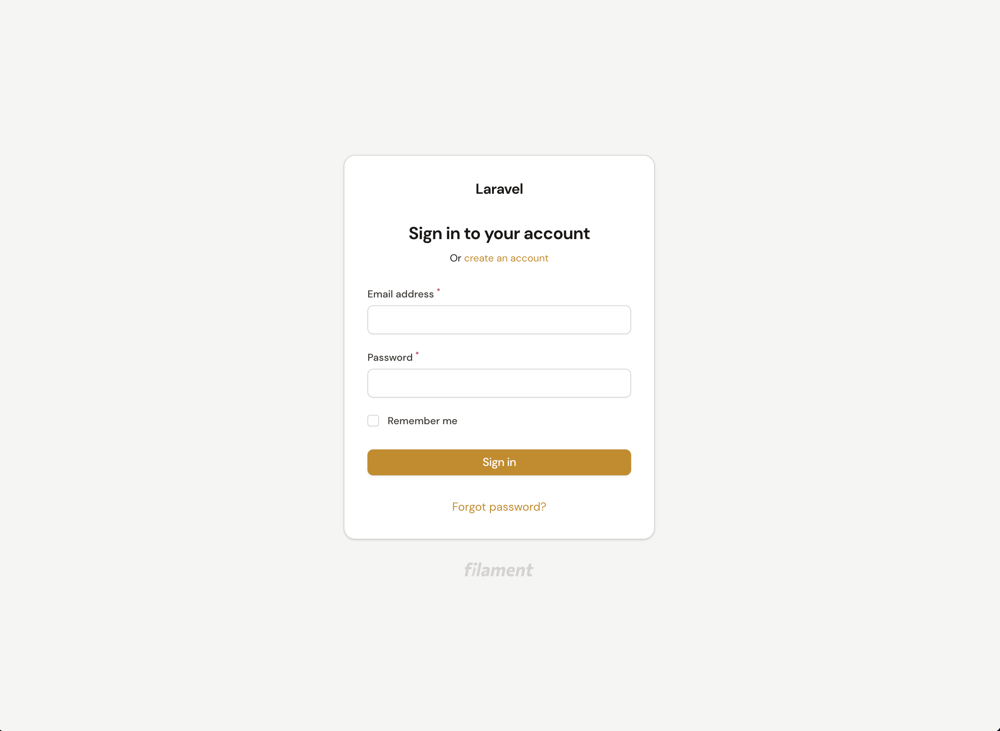
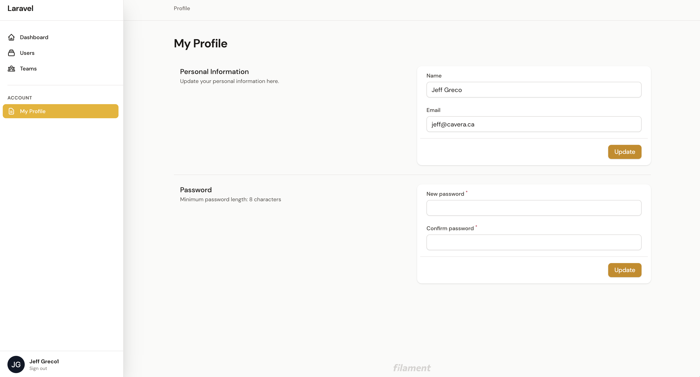
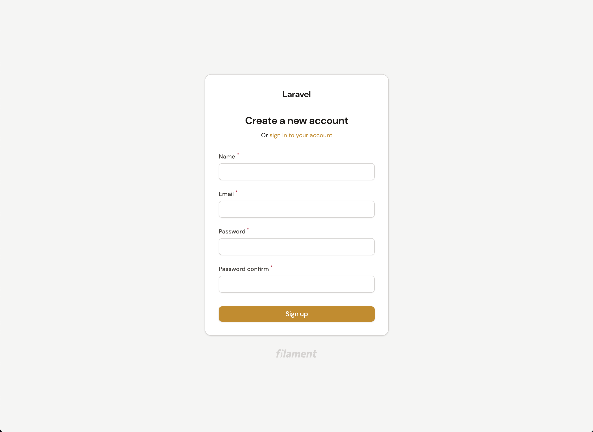
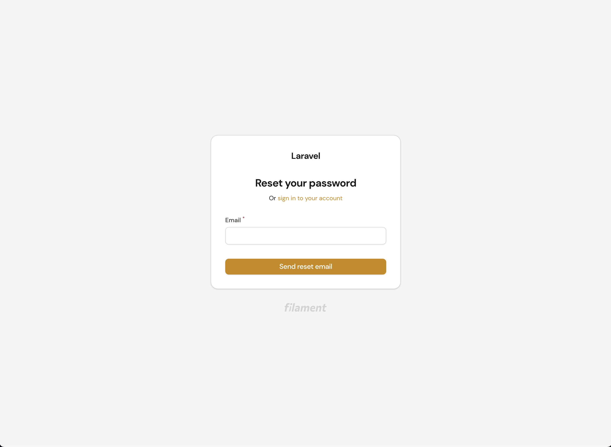
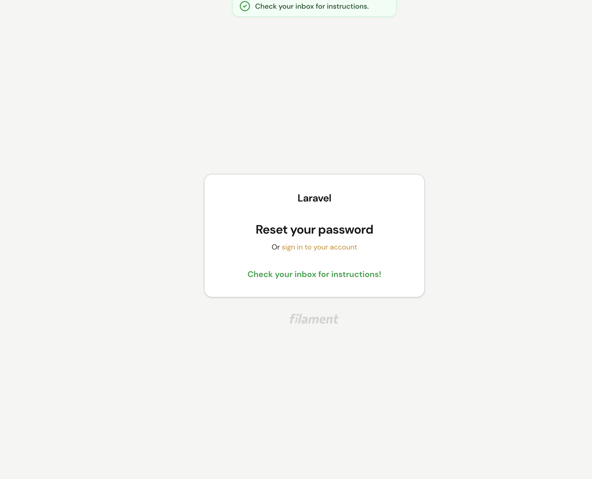
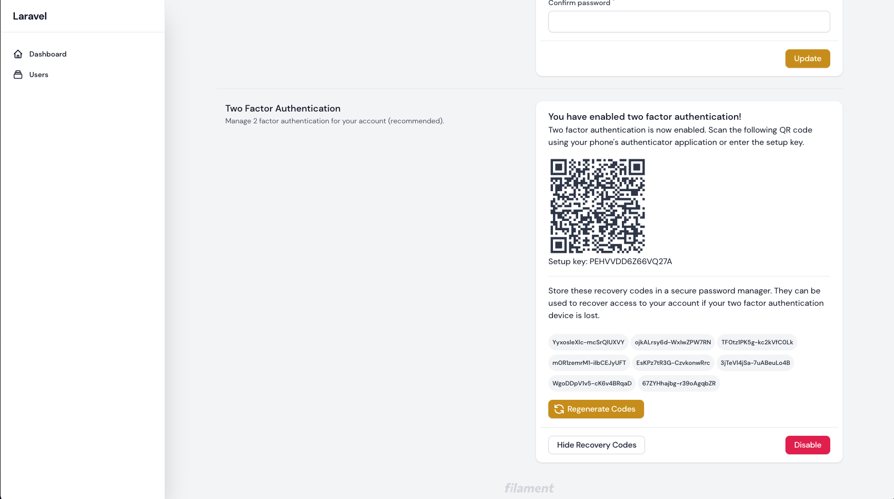
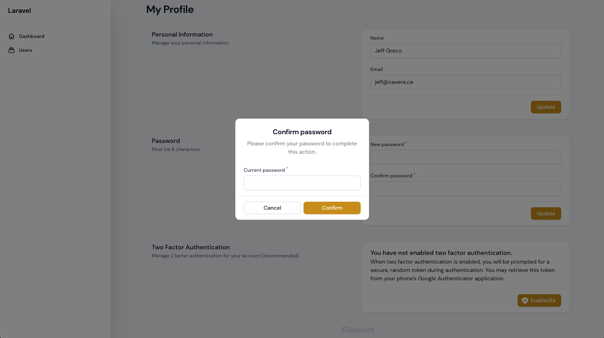
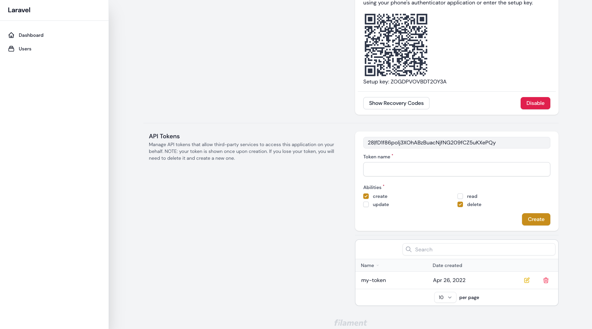

# The top authentication starter kit for Filament Admin!

[](https://packagist.org/packages/jeffgreco13/filament-breezy)
[](https://github.com/jeffgreco13/filament-breezy/actions?query=workflow%3Arun-tests+branch%3Amain)
[](https://github.com/jeffgreco13/filament-breezy/actions?query=workflow%3A"Check+%26+fix+styling"+branch%3Amain)
[](https://packagist.org/packages/jeffgreco13/filament-breezy)

The missing toolkit from Filament Admin with Breeze-like functionality. Includes login, registration, password reset, password confirmation, email verification, and a my profile page. All using the TALL-stack, all very Filament-y.

## Screenshots











## Warning: Jetstream or Breeze Users

Please read the [Routing instructions](#routing) before installing to ensure that Filament Breezy will suit your needs.


## Installation

1. Install the package via composer:

```bash
composer require jeffgreco13/filament-breezy
```

2. Update the `config/filament.php` to point to the Breezy Login::class.

```php
"auth" => [
    "guard" => env("FILAMENT_AUTH_GUARD", "web"),
    "pages" => [
        "login" =>
            \JeffGreco13\FilamentBreezy\Http\Livewire\Auth\Login::class,
    ],
],
```

Optionally, you can publish the Breezy config file for further customizations, such as Password rules, redirect after registration, and enable/disable the profile page.

```bash
php artisan vendor:publish --tag="filament-breezy-config"
```

Optionally, you can publish the views using:

```bash
php artisan vendor:publish --tag="filament-breezy-views"
```

### Enable Two Factor Authentication (2FA)

By default, 2FA is disabled. To enable it Two Factor Authentication in your app:

1. Set `enable_2fa => true` in the filament-breezy config:

```php
/*
|--------------------------------------------------------------------------
| Enable Two-Factor Authentication (2FA).
*/
"enable_2fa" => true,
```

*NOTE:* if you are using a table other than `users`, you can update the table name in the filament-breezy config or modify the published migration.

2. Publish and run the migrations:

```bash
php artisan vendor:publish --tag="filament-breezy-migrations"
php artisan migrate
```

3. Add `JeffGreco13\FilamentBreezy\Traits\TwoFactorAuthenticatable` to your Authenticatable model:

```php
use JeffGreco13\FilamentBreezy\Traits\TwoFactorAuthenticatable;

class User extends Authenticatable
{
    use HasApiTokens, HasFactory, Notifiable, TwoFactorAuthenticatable;
    ...
```

## Usage

### Routing

*COMPATIBILITY WARNING*
Breezy uses the default Laravel Auth routes, `register`, `login`, `password.request`, `password.reset`, `verification.verify` and `verification.notice` in order to deliver a seamless experience with Laravel Auth. If you are using Jetstream, Breeze, or another plugin that uses the default auth routes then you will get an error that the routes are already registered.

You can use the `"route_group_prefix"=>'',` option in the Filament Breezy config file to set a name prefix for all of Breezy's routes. Ex. `"route_group_prefix"=>'breezy.',`

However, since Breezy uses Laravel Auth to generate password reset and email verfication emails you will need to customize these emails to use the appropriate routes. For example, a user resetting their password from Filament Breezy will receive an email directing them to the `password.reset` route because Laravel Auth generates the URL in this email automatically.

Please see instructions for [Password Reset Customization](https://laravel.com/docs/9.x/passwords#password-customization) and [Email Verification Customization](https://laravel.com/docs/9.x/verification#customization) for instructions on how to customize these URLs to suit your needs.

### Customizing Password Rules

The registration, my profile and password reset forms use the same set of password validation rules. You can add new rules to the array from the filament-breezy.php config file:

```php
"password_rules" => ['min:8'],
```

If you would like to use an instance of `Illuminate\Validation\Rules\Password::class` for validation, you can register new rules from the `boot()` method of your AppServiceProvider:

```php
use Illuminate\Validation\Rules\Password;

public function boot()
{
    FilamentBreezy::setPasswordRules(
        [
            Password::min(8)
                ->letters()
                ->numbers()
                ->mixedCase()
                ->uncompromised(3)
        ]
    );
}
```

### Email Verification

Uses the [Laravel Email Verification](https://laravel.com/docs/8.x/verification) service.
Implement `MustVerifyEmail` on your User model:

```php
use Illuminate\Contracts\Auth\MustVerifyEmail;

class User extends Authenticatable implements MustVerifyEmail
```

Then you can add the `verified` middleware to any of your routes:

```php
Route::get("/profile", function () {
    // Only verified users may access this route...
})->middleware('verified');
```

Or, if you're using a custom route name prefix:

```php
Route::get("/profile", function () {
    // Only verified users may access this route...
})->middleware('verified:my-prefix.verification.notice');
```

To force verified emails on your entire Filament Admin by adding the `verified` class to the auth middleware in `config/filament.php`:

```php
"middleware" => [
    "auth" => [
        Authenticate::class,
        'verified'
    ],
    ....
```

### Extending and Overriding Components

All pages within the auth flow are full-page Livewire components made to work with Filament Forms. So you can easily extend any component to add your own fields and actions.

You can instruct Breezy to use any custom components by updating the paths in the filament-breezy config file:

```php
/*  
|--------------------------------------------------------------------------
| Path to registration Livewire component.
*/
"registration_component_path" => \JeffGreco13\FilamentBreezy\Http\Livewire\Auth\Register::class,
/*
|--------------------------------------------------------------------------
| Path to password reset Livewire component.
*/
"password_reset_component_path" => \JeffGreco13\FilamentBreezy\Http\Livewire\Auth\ResetPassword::class,
/*
|--------------------------------------------------------------------------
| Path to email verification Livewire component.
*/
"email_verification_component_path" => \JeffGreco13\FilamentBreezy\Http\Livewire\Auth\Verify::class,
```

*NOTE:* Remember, the Login path is set in the Filament config, not in the filament-breezy config.

Here is an example of extending the BreezyRegister class to add new fields to registration:

```php

use JeffGreco13\FilamentBreezy\Http\Livewire\Auth\Register as FilamentBreezyRegister;


class Register extends FilamentBreezyRegister
{
    // Define the new attributes
    public $consent_to_terms, $team_name;
    
    // Override the getFormSchema method and merge the default fields then add your own.
    protected function getFormSchema(): array
    {
        return array_merge(parent::getFormSchema(),[
            Forms\Components\Checkbox::make('consent_to_terms')->label('I consent to the terms of service and privacy policy.')->required(),
            Forms\Components\TextInput::make("team_name")->required()
        ]);
    }
    
    // Use this method to modify the preparedData before the register() method is called.
    protected function prepareModelData($data): array
    {
        $preparedData = parent::prepareModelData($data);
        $preparedData['consent_to_terms'] = $this->consent_to_terms;
        $preparedData["team_name"] = $this->team_name;

        return $preparedData;
    }
    
    // Optionally, you can override the entire register() method to customize exactly what happens at registration
    public function register()
    {
        $preparedData = $this->prepareModelData($this->form->getState());
        $team = Team::create(["name" => $preparedData["team_name"]]);
        unset($preparedData["team_name"]);
        // ...
    }
...
```

#### Extending and Customizing the Profile Page

Similar to above, you can add new fields to your Profile forms by extending the Filament Page:

```php
namespace App\Filament\Pages;

use JeffGreco13\FilamentBreezy\Pages\MyProfile as BaseProfile;
use Filament\Forms;

class MyProfile extends BaseProfile
{

  // ..

  protected function getUpdateProfileFormSchema(): array
    {
        return array_merge(parent::getUpdateProfileFormSchema(), [
            Forms\Components\TextInput::make("job_title"),
            Forms\Components\Checkbox::make("marketing_consent")->label(
                "I consent to receive email notifications....."
            ),
        ]);
    }
```

You will then need to set `"enable_profile_page" => false,` in filament-breezy config to unregister the default Profile page. When you set `"enable_profile_page" => false,` then `"show_profile_page_in_user_menu" => true` is ignored and you will need to [manually register a new item](https://filamentphp.com/docs/2.x/admin/navigation#customizing-the-user-menu) for the user menu within your service provider:

```php
use App\Filament\Pages\MyProfile;

Filament::serving(function () {
    
    // ..
    
    Filament::registerUserMenuItems([
        'account' => UserMenuItem::make()->url(MyProfile::getUrl()),
    ]);
    
    // ..
    
});
```

*NOTE:* in order to add new sections to the Profile page, you will need to extend the class and publish/create your own views. The above method will only allow for adding new fields to the existing Personal Information or Password forms.


#### Using a Column Other Than email for Login

You may want to authenticate your users using a column other than `email` in your Authenticatable model. After you have setup your database, you can change the column in the config:

```php
"fallback_login_field" => "username",
```

Optionally, update the field label in your language file:

```php
"fields" => [
   //
   "login" => "Username",
   //
```

### Password Confirmation Button Action

Since v1.3.0, Breezy has a `PasswordButtonAction` shortcut which extends the default Page\ButtonAction class. This button action will prompt the user to enter their password for sensitive actions (eg. delete), then will not ask for password again for the # of seconds defined in the filament-breezy config (default 300s).

```php
use JeffGreco13\FilamentBreezy\Actions\PasswordButtonAction;

PasswordButtonAction::make('secure_action')->action('doSecureAction')

// Customize the icon, action, modalHeading and anything else.
PasswordButtonAction::make('secure_action')->label('Delete')->icon('heroicon-s-shield-check')->modalHeading('Confirmation')->action(fn()=>$this->doAction())
```


### Sanctum API Tokens

The most recent version of Laravel include Sanctum, but if you don't already have the package follow the [installation instructions here](https://laravel.com/docs/8.x/sanctum#installation).

As soon as Sanctum is installed, you are ready to allow users to create new API tokens from the Profile page. Enable this option in the config:
`enable_sanctum => true`

You can then control the available permissions abilities from the config, which will add each ability as a checkbox:
`"sanctum_permissions" => ["create", "read", "update", "delete"]`

Follow the Sanctum instructions for authenticating requests as usual.

## Testing

```bash
composer test
```

## Changelog

Please see [CHANGELOG](CHANGELOG.md) for more information on what has changed recently.

## Contributing

Please see [CONTRIBUTING](.github/CONTRIBUTING.md) for details.

## Security Vulnerabilities

Please review [our security policy](../../security/policy) on how to report security vulnerabilities.

## Credits

-   [Jeff Greco](https://github.com/jeffgreco13)
-   [All Contributors](../../contributors)

## License

The MIT License (MIT). Please see [License File](LICENSE.md) for more information.
